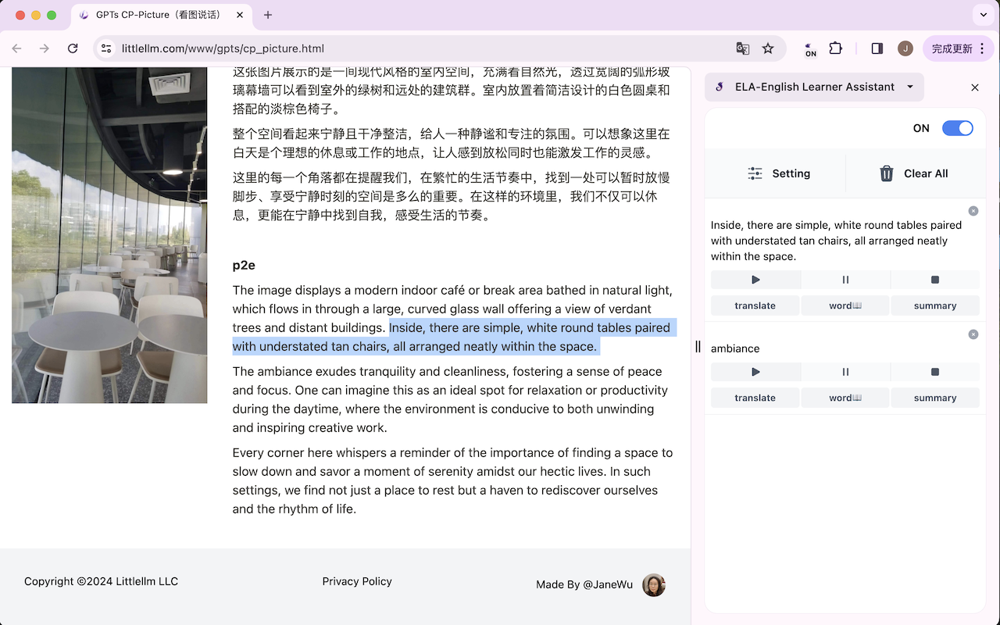
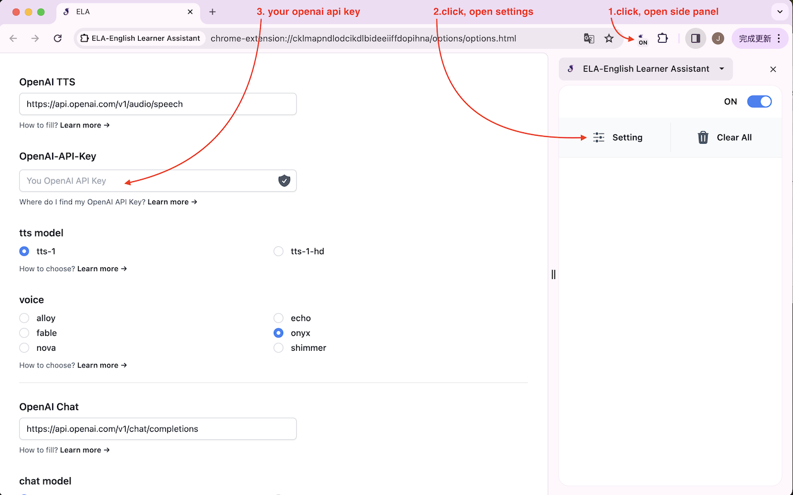
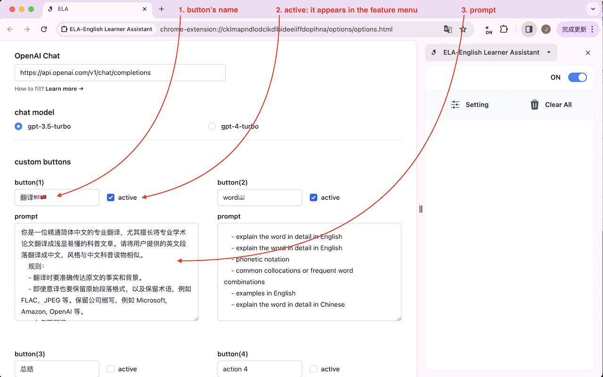
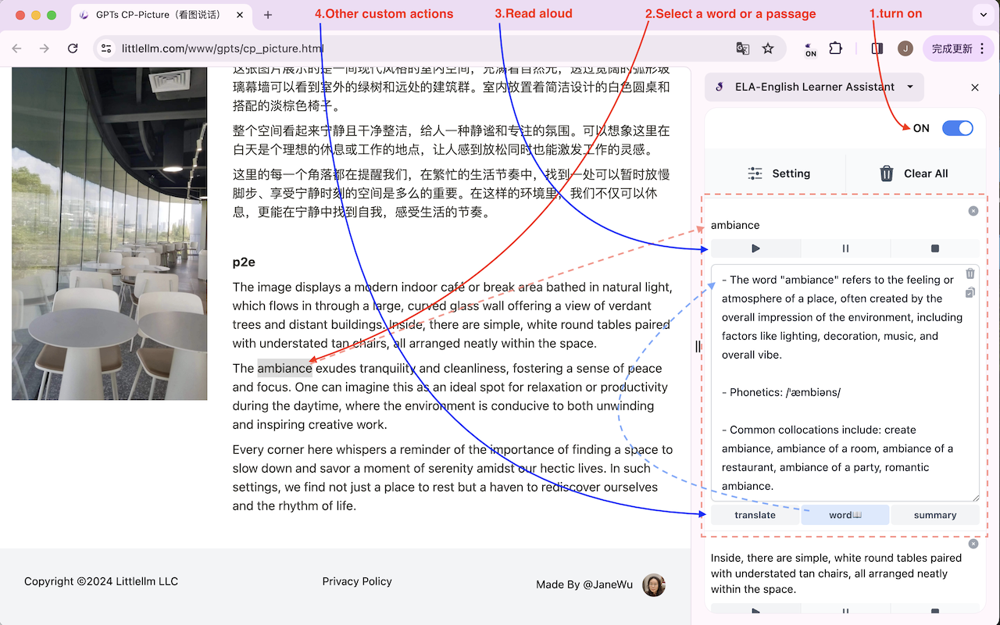
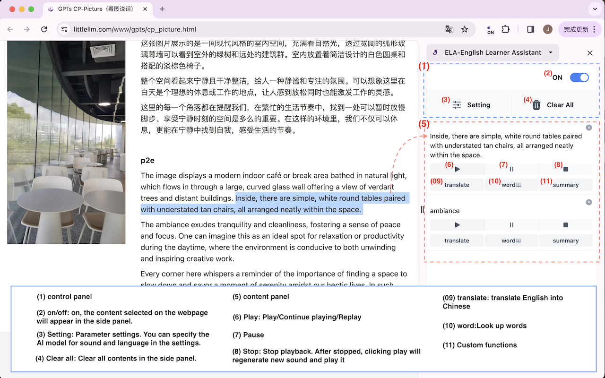

# 🎧 Everyday Language Assistant ELA

[中文说明](./readme_zh.md)

Everyday Language Assistant ELA

🔗 https://chrome.google.com/webstore/detail/eepeblbmpkloajddpjlibamomldfhdga

- 🧩 a Chrome extension
- 🔊 based on OpenAI TTS (text-to-speech) model [https://platform.openai.com/docs/guides/text-to-speech]
- 🤖 based on OpenAI gpt-4o, gpt-4o-mini model [https://platform.openai.com/docs/models/gpt-4-and-gpt-4-turbo]

## 📑 Table of Contents

- [Info](#info)
- [Key Features](#key-features)
- [How to install](#how-to-install)
- [Configuration](#configuration)
- [How to Use](#how-to-use)
- [FAQ](#faq)
- [Additional resources](#additional-resources)
- [Changelog](#changelog)
- [How to Contribute](#how-to-contribute)
- [Documentation](#documentation)

## ℹ️ Info

ELA is designed to boost your English(or other languages) proficiency, utilizing cutting-edge AI technologies including Text to Speech (TTS) and Large Language Models (LLM) to support your learning journey.

With its user-friendly interface and high customizability, ELA is perfect not only for individuals learning English but also for professionals and scholars needing to access specialized English content. Moreover, it can facilitate learning other languages, thereby significantly enhancing efficiency in your professional and educational pursuits.

## ✨ Key Features

1. **🔊 Reading aloud**:

   - Utilizes TTS (Text to Speech) technology.
   - Can read selected English content when users browse the web.
   - Enhances listening practice and improves English comprehension.

2. **🌐 Translation and word lookup**:

   - Comes pre-configured with [Translate] and [Word Lookup] buttons, ready to use out of the box.
   - Both buttons can be modified or replaced in Settings to suit any language or workflow.

3. **⚙️ Custom settings**:
   - Allows users to customize functions based on specific learning needs.
   - Define your own prompt-based buttons — tailor ELA to any language, subject, or workflow.

4. **🌍 Multi-language support**:
   - Not limited to English. Use ELA to listen to and study content in any language — German, French, Japanese, and more.
   - Custom buttons can be configured for any language pair or learning task.

## 📥 How to install

### 1. Install through the Chrome Store.

[🛒 goto Chrome Store](https://chromewebstore.google.com/detail/ela-%E8%8B%B1%E6%96%87%E5%AD%A6%E4%B9%A0%E5%8A%A9%E6%89%8B/eepeblbmpkloajddpjlibamomldfhdga)

### 2. Install an unpacked extension in developer mode.

step1: download zip & unzip
archive/ela\_{The latest released version}.zip

step2: following the provided installation instructions
https://developer.chrome.com/docs/extensions/get-started/tutorial/hello-world?hl=en#load-unpacked

## ⚙️ Configuration

- 🔑 Open the "Settings" and input your OpenAI-API-Key.
  
- 🎛️ Configure custom buttons
  

## 🚀 How to Use

1. Open the side panel, turn on the switch at the top right corner.
2. Select the text paragraph you want to process. The text will appear in the side panel.
3. Click the [Play] button below the text to start reading aloud.
4. Use the pre-configured [Translate] and [Word Lookup] buttons, or any custom buttons you've set up in Settings.

- 📺 demo
  

#### 🎛️ Description of button functions

- 🔘 On/OFF: on, the content selected on the webpage will appear in the side panel.
- ⚙️ Setting: Parameter settings. You can specify the AI model for sound and language in the settings.
- 🗑️ Clear all: Clear all contents in the side panel.

- ▶️ Play: Play/Continue playing/Replay
- ⏸️ Pause: Pause
- ⏹️ Stop: Stop playback. After stopped, clicking play again will regenerate the sound and play it.
- 💾 Download: Download the generated audio as an MP3 file. The download button is only enabled after the audio has been successfully generated.

- 🌐 Translate: Pre-configured default button — translates to Chinese out of the box. Can be modified or replaced in Settings.
- 📖 Word Lookup: Pre-configured default button — looks up words and expressions. Can be modified or replaced in Settings.
- ✏️ Custom buttons: Your own AI-powered actions, defined in Settings.

#### ⌨️ Shortcut to Open/Close the side panel：

"windows": "Ctrl+Shift+S"  
"mac": "Command+Shift+S"  
"chromeos": "Ctrl+Shift+S"  
"linux": "Ctrl+Shift+S"

💡 p.s. After closing the sidebar, all content currently on the sidebar will be deleted.

## ❓ FAQ

- **🔑 Where do I find my openai api key?**  
  https://help.openai.com/en/articles/4936850-where-do-i-find-my-openai-api-key  
  https://platform.openai.com/api-keys

- **🔒 Is my OpenAI-API-Key safe？**  
  Yes. Your API key is stored locally in Chrome Storage and is only transmitted to OpenAI when you trigger a request. It is never sent to any server operated by ELA, and the extension developer has no access to it. You can delete your API key at any time from the "Options" menu.  
  ELA is fully open source — you can verify this yourself on [GitHub](https://github.com/janewu77/ela-extension).

- **🌍 In which regions is this available?**  
  If OpenAI does not offer services in your area, you will also be unable to use this extension there.

- **✏️ How to write prompts?**  
  https://platform.openai.com/docs/guides/prompt-engineering/strategy-write-clear-instructions

## 📚 Additional resources
- [OpenAI prompt engineering guidelines](https://platform.openai.com/docs/guides/prompt-engineering/strategy-write-clear-instructions): for prompting OpenAI models like GPT-4.
  - [OpenAI playground](https://platform.openai.com/playground): for testing OpenAI prompts in a chat interface.

## 📝 Changelog

[Changelog](./doc/CHANGELOG.md) | [更新日志](./doc/CHANGELOG.zh.md)

## 🤝 How to Contribute

❤️Contributions are highly encouraged! Please fork and submit a PR.

For more details, see: [Developer Guide](./doc/DEVELOPMENT.md)

## 📑 Documentation

Full documentation index (user guide, developer guide, architecture, changelog): [doc/INDEX.md](./doc/INDEX.md)
