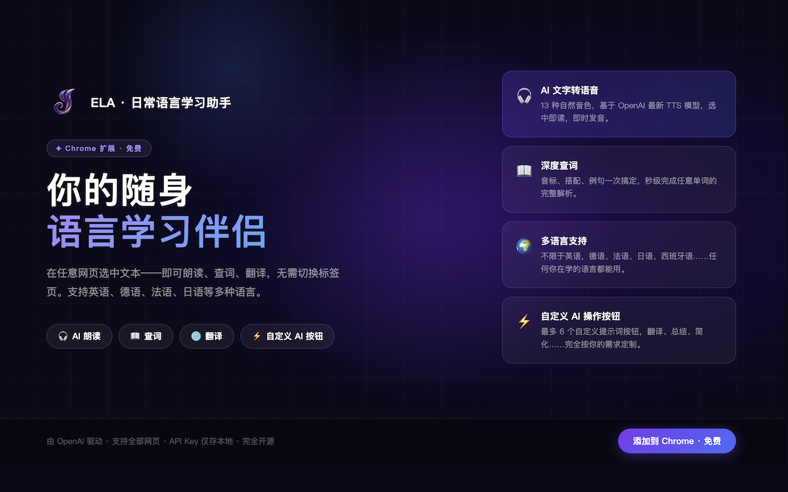
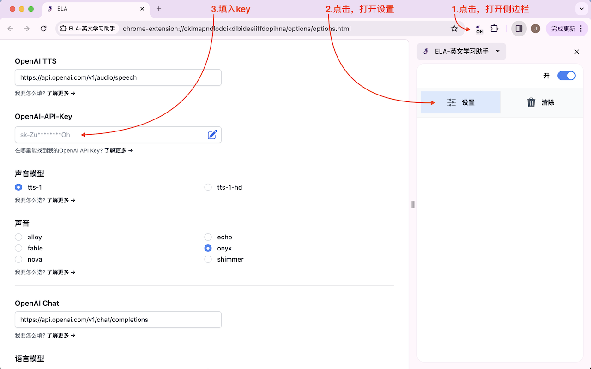
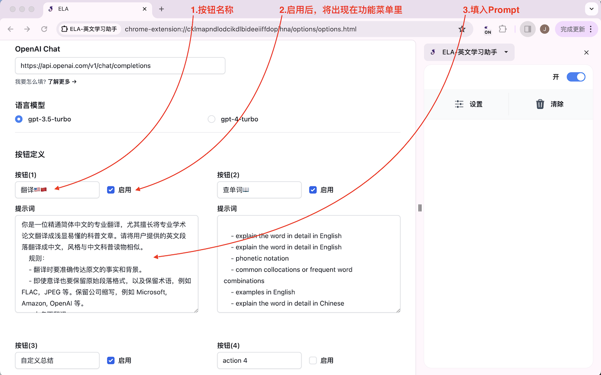
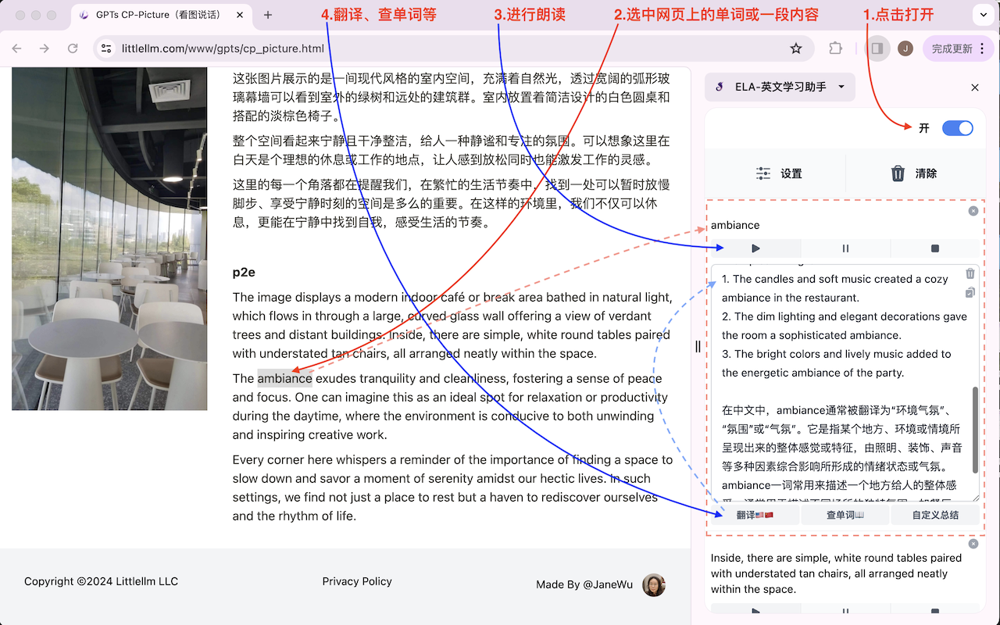
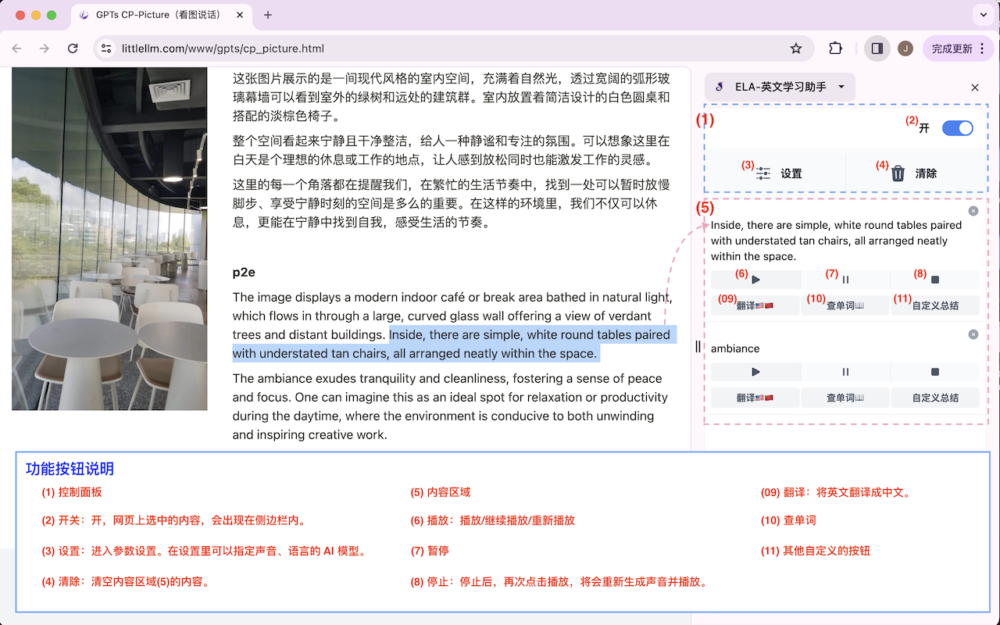

# 🎧 ELA — Everyday Language Assistant

[English Version](./readme.md) | [🛒 Chrome 应用商店](https://chromewebstore.google.com/detail/ela-everyday-language-ass/eepeblbmpkloajddpjlibamomldfhdga)

一款 Chrome 插件，在网页上选中任意文字，即可朗读、翻译、AI 解析 —— 基于 OpenAI TTS 与 GPT-5.4。

## 📑 目录

- [概述](#概述)
- [主要功能](#主要功能)
- [如何安装](#如何安装)
- [配置](#配置)
- [如何使用](#如何使用)
- [FAQ](#faq)
- [其他有用的资源](#其他有用的资源)
- [更新日志](#更新日志)
- [如何贡献](#如何贡献)
- [文档索引](#文档索引)

## ℹ️ 概述

ELA 让任意网页变成你的语言学习空间。选中文字，ELA 就能在 Chrome 侧边栏里帮你朗读、翻译或用 AI 解析。

适合外语学习者、需要阅读专业外文资料的职场人，以及所有想从网页内容中获得更多的人。

## ✨ 主要功能

1. **🔊 朗读功能**：

   - 利用 TTS（文字转语音）技术。
   - 当用户浏览网页时，能朗读选定的英文内容。
   - 增强听力练习，提升英语理解能力。

2. **🌐 翻译查词**：

   - 预置了【英翻中】和【查单词】按钮，开箱即用。
   - 两个按钮均可在设置中修改或替换，适配任何语言或使用场景。

3. **⚙️ 自定义设置**：
   - 允许用户根据具体学习需求自定义功能。
   - 通过定义 prompt 来调整功能，实现个性化配置，适用于任何语言学习场景。

4. **🌍 多语言支持**：
   - 不限于英语。使用 ELA 收听和学习任何语言的内容——德语、法语、日语等均可。
   - 自定义按钮可配置为任意语言对或学习任务。

## 📥 如何安装

### 1. 通过 Chrome 商店安装

[🛒 打开商店进行安装](https://chromewebstore.google.com/detail/ela-%E8%8B%B1%E6%96%87%E5%AD%A6%E4%B9%A0%E5%8A%A9%E6%89%8B/eepeblbmpkloajddpjlibamomldfhdga)

### 2. 用压缩包安装（开发者模式）

step1: 从 [GitHub Releases](https://github.com/janewu77/ela-extension/releases) 下载最新 zip 并解压

step2: 根据安装指令进行安装  
https://developer.chrome.com/docs/extensions/get-started/tutorial/hello-world?hl=zh-cn#load-unpacked

## ⚙️ 配置

- 🔑 打开“设置”填入 openAI-API-key  
  
- 🎛️ 配置自定义按钮
  

## 🚀 如何使用

1. 打开侧边栏，打开右上角的开关。
2. 选中想要处理的文字段落。文字将会出现在侧边栏内。
3. 点击文字下方的【播放键】开始朗读。
4. 点击预置的【英翻中】【查单词】按钮，或使用你在设置中配置的自定义按钮。

- 📺 功能演示
  

#### 🎛️ 按钮说明

- 🔘 开/关：打开，网页上选中的内容，会出现在侧边栏内；关闭，网页上选中的内容不会出现在侧边栏内。
- ⚙️ 设置[选项]：进入参数设置。在设置里可以指定声音、语言的 AI 模型。
- 🗑️ 清除：清空侧边栏内的选中的内容。

- ▶️ 播放：播放/继续播放/重新播放
- ⏸️ 暂停
- ⏹️ 停止：停止播放。停止后，再次点击播放，将会重新生成声音并播放。
- 💾 下载：将生成的音频下载为 MP3 格式文件。只有在音频生成成功后，下载按钮才会启用。

- 🌐 英翻中：预置的默认按钮，开箱即用，翻译成中文。可在设置中修改或替换。
- 📖 查单词：预置的默认按钮，查询单词和词组。可在设置中修改或替换。
- ✏️ 自定义按钮：在设置中定义你自己的 AI 功能，支持任意语言和任务场景。

#### ⌨️ 打开/关闭侧边栏的快捷方式：

"windows": "Ctrl+Shift+S"  
"mac": "Command+Shift+S"  
"chromeos": "Ctrl+Shift+S"  
"linux": "Ctrl+Shift+S"

💡 注意：关闭侧边栏后，当前侧边栏上的所有内容都会被清除。

## ❓ FAQ

- **🔑 在哪里能找到我的 OpenAI API Key?**  
  https://help.openai.com/en/articles/4936850-where-do-i-find-my-openai-api-key  
  https://platform.openai.com/api-keys

- **🔒 我的 OpenAI-API-Key 安全吗？**  
  安全。您的 API Key 仅保存在本地 Chrome Storage 中，只有在您触发请求时才会传递给 OpenAI，不会发送到 ELA 的任何服务器，开发者也无法访问。您可以随时在”选项”中删除您的 API Key。  
  ELA 完全开源，您可以随时在 [GitHub](https://github.com/janewu77/ela-extension) 上查看代码自行验证。

- **🌍 哪些地区可以使用？**  
  如果您所在的地区，openAI 并不提供服务，则同样的，你也无法在这里使用。

- **✏️ 提示词怎么写？**
  https://platform.openai.com/docs/guides/prompt-engineering/strategy-write-clear-instructions

## 📚 其他有用的资源

- [OpenAI 提示词工程指南](https://platform.openai.com/docs/guides/prompt-engineering/strategy-write-clear-instructions): 针对 openAI 模型的提示词写作指南.
  - [OpenAI 试用入口](https://platform.openai.com/playground): 通过聊天界面调试 prompt.

## 📝 更新日志

[更新日志](./CHANGELOG.zh.md) | [Changelog](./CHANGELOG.md)

## 🤝 如何贡献

❤️欢迎贡献代码！请 Fork 项目并提交 Pull Request。

更多详细信息请参考：[开发者指南](./doc/DEVELOPMENT.zh.md)

## 📑 文档索引

完整文档索引（用户指南、开发者指南、架构、更新日志）：[doc/INDEX.md](./doc/INDEX.md)
